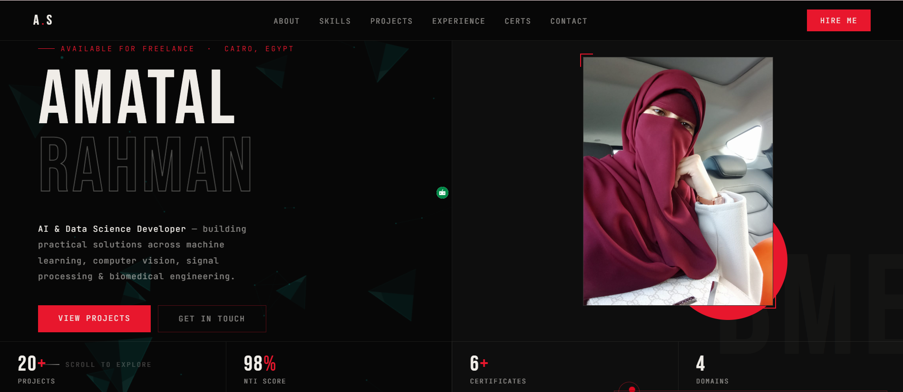
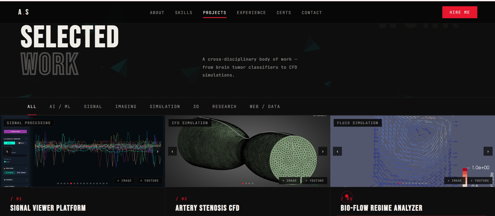
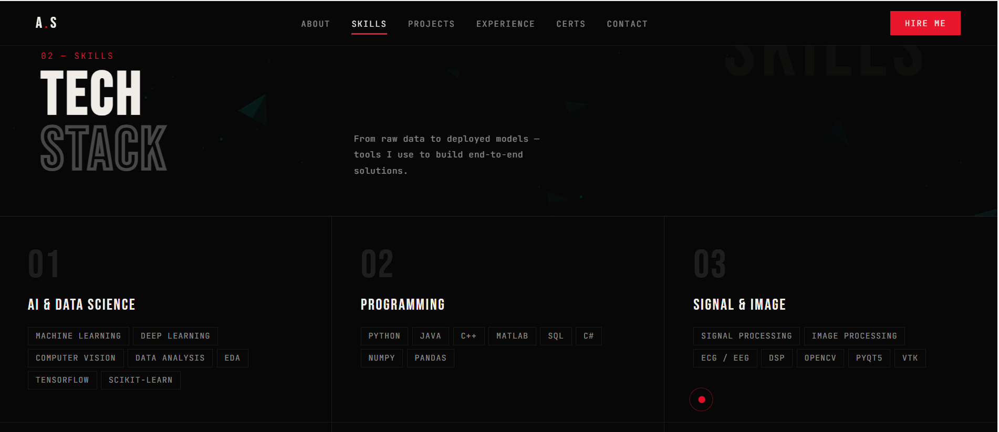
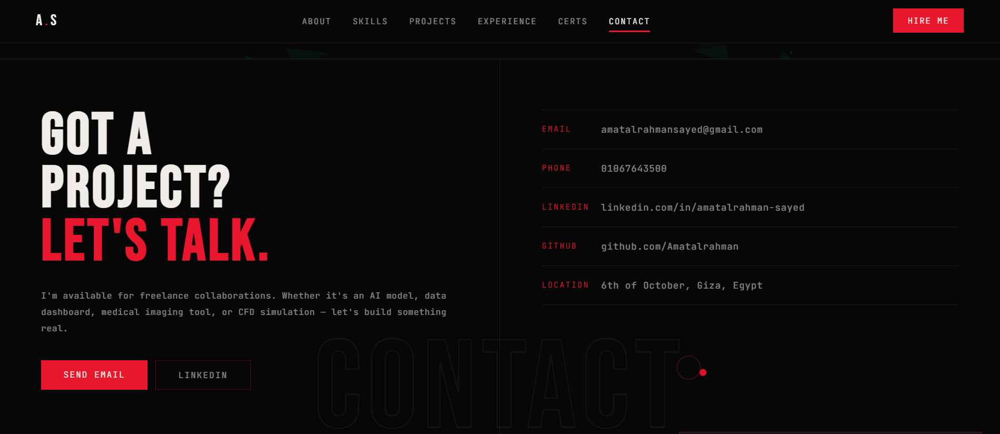

# Amatalrahman Sayed — Portfolio

> AI & Biomedical Engineering portfolio — built from scratch with HTML, CSS & JavaScript.

[](https://amatalrahman.github.io)
[](https://github.com/Amatalrahman)

---

## Overview

Personal portfolio showcasing 17+ projects across AI/ML, biomedical signal processing, medical imaging, CFD simulation, 3D modeling, and data visualization.

---

## Tech Stack


- No frameworks — fully custom
- Canvas API for animated particle background
- Responsive design (mobile-friendly)
- Editable content via `contenteditable`

---

## Sections

| # | Section | Description |
|---|---------|-------------|
| 01 | About | Background, education & contact details |
| 02 | Skills | Tech stack across 6 domains |
| 03 | Projects | 17 projects with media galleries & filters |
| 04 | Experience | Training programs & leadership roles |
| 05 | Certificates | 6 verified credentials |
| 06 | Contact | Email, LinkedIn, GitHub |

---

## Screenshots

<table>
  <tr>
    <td></td>
    <td></td>
  </tr>
  <tr>
    <td align="center"><em>Hero Section</em></td>
    <td align="center"><em>Projects Grid</em></td>
  </tr>
  <tr>
    <td></td>
    <td></td>
  </tr>
  <tr>
    <td align="center"><em>Skills</em></td>
    <td align="center"><em>Contact</em></td>
  </tr>
</table>

---

## Project Domains

- **AI / ML** — Brain tumor classifier, car price prediction, ECG classification
- **Signal Processing** — Multi-domain signal viewer platform, Parkinson's telemonitoring
- **Medical Imaging** — Multi-planar viewer, image enhancer, organ classification
- **CFD Simulation** — Artery stenosis analysis, bio-flow regime analyzer
- **3D Modeling** — Anatomy puzzle game, neuron model, endoscopy room
- **Data Visualization** — COVID-19 interactive dashboard

---

## Contact

**Email** — amatalrahmansayed@gmail.com  
**LinkedIn** — [linkedin.com/in/amatalrahman-sayed](https://www.linkedin.com/in/amatalrahman-sayed)  
**GitHub** — [github.com/Amatalrahman](https://github.com/Amatalrahman)

---

<p align="center">Cairo University · Biomedical Engineering · Class of 2028</p>
```

